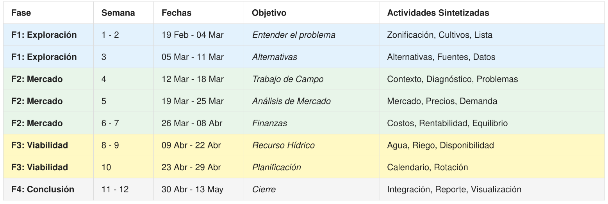

# SeminarioIA-LCC-UNISON-2026

Repositorio para la clase de Seminario de Inteligencia Artificial para la Licenciatura en Ciencias
de la Computación de la Universidad de Sonora.

## Introducción

Las principales actividades económicas primarias realizadas en el estado de Sonora incluyen a la
Agricultura, Ganadería, Pesca y Minería. Con respecto a la primera, actualmente una gran cantidad de
agua es utilizada por los agricultores para su trabajo en los campos.

El estado de Sonora presenta condiciones climáticas desérticas, e históricamente ha enfrentado
varias sequías. Es por esto que es necesario enfocarnos en el problema de la utilización óptima de
sus recursos hídricos.

De los diferentes cultivos que se cosechan en el estado hay algunos que destacan por su necesidad de
grandes cantidades de agua. Con este trabajo se intenta encontrar alternativas más viables para los
cultivos actuales. Es decir, alternativas que optimicen el uso del agua y, a su vez, la rentabilidad
de los mismos. Con el análisis efectuado, se busca apoyar a los agricultores de Sonora con dichas
alternativas.

## Objetivo General

> Conversión de los cultivos de Sonora por otros que optimicen el uso del agua y su rentabilidad, en
> apoyo a los agricultores.

## Contenido del repositorio

```bash
SeminarioIA-LCC-UNISON-2026/
├── data/
│   ├── raw/            # Datos originales
│   ├── processed/      # Datos limpios listos para modelar
├── docs/               # Documentos, PDFs a leer, referencias bibliográficas, etc.
├── notebooks/          # Jupyter Notebooks para exploración y pruebas rápidas
├── src/                # Código fuente (scripts .py)
│   ├── extraction/     # Scripts para leer fuentes y cargar datos
│   ├── analysis/       # Lógica de análisis de datos
│   └── visualization/  # Generación de gráficas
├── reports/            # Borradores del informe final
├── .gitignore          # Gitignore
└── README.md           # Explicación del proyecto
```

## Metodología



### FASE 1. EXPLORACIÓN Y DIAGNÓSTICO.

Entendimiento general de la agricultura en Sonora y recopilación de información relevante de fuentes
oficiales.

### FASE 2. ANÁLISIS DE MERCADO Y RENTABILIDAD.

Recopilación de datos pertinentes para la propuesta de optimización en rentabilidad y sostenibilidad
en cultivos de Sonora, con enfoque en los recursos hídricos utilizados.

### FASE 3. ANÁLISIS TÉCNICO Y VIABILIDAD.

Análisis técnico exhaustivo de los datos recopilados, realizando estimaciones y clasificaciones con
prioridad en la viabilidad, rentabilidad y disponibilidad, entre otros factores.

### FASE 4. CONCLUSIÓN Y RECOMENDACIÓN.

Consolidación de los datos de Mercado, Rentabilidad y Viabilidad Técnica/Agua y la elaboración del
informe final.

## Datos

Revisar `data/raw` para los datos obtenidos.

```
data/raw
├── datos-abiertos
│   ├── agricultura
│   │   └── datos
│   └── recursos-hidricos
│       └── datos
├── datos_proporcionados
├── datos-sequia
├── siacon
└── siap-produccion-agricola
    ├── municipal
    ├── nacional
    └── no-seguimiento
```

### Espacio Compartido Multiusos

Para facilitar la colaboración, se ha creado un espacio compartido en Google Drive para subir
archivos, compartir documentos y mantener un registro de las actividades del proyecto.

## Development

Para trabajar en el proyecto, se recomienda seguir la estructura de carpetas propuesta. Para cada
fase del proyecto, se pueden crear scripts específicos en la carpeta `src` para la extracción,
análisis y visualización de datos.

### Herramientas recomendadas

- **Python** 3.10 o superior
- [**UV**](https://docs.astral.sh/uv/) para gestión de dependencias y entornos virtuales.
- Jupyter Notebooks para exploración y análisis rápido.
- Librerías: pandas, numpy, matplotlib, etc.

Nota: las librerías específicas pueden variar según las necesidades del análisis, pero se recomienda
mantener un entorno de desarrollo organizado y documentado.

Se adjunta un archivo `pyproject.toml` con la configuración del proyecto y las dependencias
necesarias para facilitar la instalación y gestión del entorno de desarrollo.

```bash

...
dependencies = [
    "numpy>=1.21.0",
    "pandas>=1.3.0",
    "matplotlib>=3.4.0",
    "PyYAML>=6.0",
    "tqdm>=4.60.0",
    "pydantic>=2.12.4",
    "openpyxl>=3.1.5",
    "polars>=1.38.1",
]

[dependency-groups]
dev = [
    "ruff>=0.1.0",
    "pre-commit>=2.15.0",
    "ty>=0.0.6",
]

[project.optional-dependencies]
jupyter = [
    "jupyter>=1.0.0",
    "ipykernel>=6.0.0",
    "ipywidgets>=7.6.0",
]
...

```

### Uso de UV

#### Para instalar dependencias

Para instalar las dependencias del proyecto, se puede usar el siguiente comando:

```bash
uv sync --no-dev
```

Para instalar las dependencias de desarrollo, se puede usar:

```bash
uv sync --dev
```

Para instalar las dependencias opcionales para Jupyter, se puede usar:

```bash
uv sync --extra jupyter
```

Para instalar todas las dependencias (incluyendo desarrollo y opcionales), se puede usar:

```bash
uv sync --dev --extra jupyter
```

o

```bash
uv sync --all
```

#### Para correr un script

Para ejecutar un script específico, se puede usar el siguiente comando:

```bash
uv run python mi_script.py
```

Para utilizar `Ruff`:

```bash
uv run ruff check src/ # Revisa el código en la carpeta src
```

### Workflow sugerido

#### Obtener el repositorio

- **Fork** del repositorio para trabajar en tu propia copia.
- Clonar tu fork localmente. Por ejemplo, con SSH (depende de cómo tengas configurado tu acceso a
  GitHub):

```bash
git clone git@github.com:JesusF10/SeminarioIA-LCC-UNISON-2026.git
```

- Pueden trabajar con la rama principal (`main`).

#### Guardar y actualizar cambios

- Realizar cambios en tu entorno local.

```bash
git add . # Agrega los archivos modificados al staging
```

- Hacer commit de los cambios con un mensaje descriptivo.

```bash
git commit -m "Descripción de los cambios realizados"
```

- Subir los cambios a tu fork en GitHub.

```bash
git push origin main
```

- En GitHub, crear un Pull Request desde tu fork hacia el repositorio original para que los cambios
  sean revisados e integrados.

## Datos del Proyecto

Los datos se dividen en tres categorías principales (`raw`, `processed` y `config`). El acceso y
lectura de estos se centraliza a través del submódulo `seminario_ia.datasets`.

### Datos Crudos (data/raw/)

- `conagua/`: Títulos de concesión (REPDA) y almacenamiento de presas.
- `datos-abiertos/`: Agricultura y recursos hídricos en Sonora (Gobierno).
- `datos-sequia/`: Registros históricos del Monitor de Sequía de la CONAGUA.
- `datos_proporcionados/`: Información general provista al inicio del proyecto.
- `sader/`: Datos de Distritos de Desarrollo Rural (DDR) y oficinas del estado.
- `siacon/`: Archivos del Sistema de Información Agroalimentaria y Pesquera.
- `siap-produccion-agricola/`: Estadísticas de producción municipal e histórica.

### Datos Procesados (data/processed/)

- `SonoraLatLongAlt.csv`: Ubicaciones geográficas y altitud por municipio.
- `monitor_sequia_sonora.csv`: Historial depurado de sequía municipal en Sonora.
- `sequia_indices_sonora.csv`: Índices de recurrencia y severidad de sequía.
- `analisis_municipal_sonora_2010_2024.csv`: Datos consolidados multivariables.
- `nasa_power/`: Datos climáticos diarios del servicio NASA POWER (2003-2024) organizados en formato
  CSV por municipio y año.
- `siap_produccion/sonora/`: Datos de producción agrícola de la SIAP (2003-2024) filtrados y
  limpiados para el estado de Sonora.
- `analisis_municipal/`: Resultados agregados por municipio del análisis anual.

### Configuración (data/config/)

- `cultivos.json`: Catálogo de cultivos con sus Kc (inicial, medio, final), duraciones de etapas y
  calendarios de siembra/cosecha.
- `codificaciones.json`: Mapeo oficial entre claves municipales (`CVE_MUN`), DDR (SADER) y DR
  (CONAGUA) en el estado.

---

## Estructura de la Librería (`src/seminario_ia/`)

El código del proyecto está estructurado como un paquete instalable de Python:

```bash
src/seminario_ia/
├── __init__.py          # Inicialización del paquete y exportación de API
├── cli/                 # Interfaz de línea de comandos (main.py)
├── models/              # Modelos de datos con tipado estricto (Pydantic)
│   ├── __init__.py
│   └── data_models.py   # Definición de las clases Crop y Region
├── datasets/            # Mapeo y cargadores de conjuntos de datos
│   ├── __init__.py
│   ├── codes.py         # Decodificación y mapeo de códigos municipales
│   ├── data.py          # Consultas y filtros a nivel de API
│   ├── paths.py         # Centralización de rutas de datos del proyecto
│   └── repository.py    # Repositorio que encapsula la lectura de datos
├── analysis/            # Algoritmos de cálculo de reconversión agrícola
│   ├── __init__.py
│   └── pipeline.py      # Pipeline de cálculo (ETo, huella hídrica, etc.)
├── utils/               # Utilidades generales del sistema
│   ├── __init__.py
│   ├── date.py          # Utilidades para manipulación de fechas
│   ├── eto.py           # Algoritmos de evapotranspiración (FAO-56)
│   ├── nasa_power.py    # Cliente HTTP para descarga de datos NASA POWER
│   ├── performance.py   # Métricas de rendimiento y perfilamiento de código
│   └── validation.py    # Funciones de validación de esquemas y formatos
├── scripts/             # Scripts internos utilitarios y de validación
│   ├── __init__.py
│   ├── inspect_columns.py
│   ├── inspect_metadata.py
│   └── test_data.py
└── visualization/       # Generación de gráficos y reportes visuales
    └── __init__.py
```

## Notebooks

En la carpeta `notebooks/` se encuentran scripts de exploración rápidos, pruebas de visualización y
desarrollo interactivo de nuevas funciones.

## Referencias

- [Plan de trabajo](docs/PlanDeTrabajo.pdf)
- [Presentación Reconversión Productiva (18 de Febrero de 2026)](docs/Presentaciom-DEyT-Reconversion-productiva_18FEB2026.pdf)
- [Datos Abiertos](https://www.sonora.gob.mx/datos/)
- [Anuario Estadístico de la Producción Agrícola (SIAP)](https://nube.agricultura.gob.mx/cierre_agricola/)
- [FIRA - Agrocostos (Costos de Producción 2024-2025)](https://www.fira.gob.mx/InfraestructuraWeb/AnexosStatico.jsp?IdAnexo=7372)
- [INIFAP - Paquetes Tecnológicos y Requerimientos Hídricos](https://www.gob.mx/inifap)
- [CONAGUA - Almacenamiento de Presas](https://www.gob.mx/conagua)
- [SIACON](https://www.gob.mx/agricultura/dgsiap/documentos/siacon-ng-161430)
- [NASAPOWER](https://power.larc.nasa.gov/api/pages/)
